# Satu Raya Accounts

`apps/accounts` adalah service Identity and Access Management (IAM) untuk ekosistem Satu Raya. Service ini menjadi pusat registrasi, login, session, 2FA, email verification, reset password, OAuth, permission metadata, API client, consent SSO, dan audit aktivitas akun.

Accounts tidak menyimpan domain bisnis utama seperti lowongan kerja, profil pekerja lengkap, payroll, attendance, contract, wallet, atau recruitment flow. Domain tersebut berada di service lain, sedangkan Accounts menyediakan identitas pengguna, tenant, session, dan event sinkronisasi akun.

## Tech Stack

| Area | Teknologi |
| --- | --- |
| Framework | Ruby on Rails 8.1 |
| Bahasa | Ruby 3.3 |
| Database | PostgreSQL dengan UUID dan `pgcrypto` |
| Background job | Solid Queue |
| Auth | `has_secure_password`, session cookie, JWT, OAuth |
| Multi-tenancy | `acts_as_tenant` dan `tenant_id` di tabel IAM |
| Authorization | Pundit dan `user_permissions` |
| 2FA | TOTP via `rotp`, QR setup via `rqrcode` |
| Security | Rack Attack, CORS, HMAC signature untuk user sync |
| Shared domain | `satu-raya-commons` dari `packages/commons` |

## Tanggung Jawab Service

- Registrasi akun publik untuk role `worker` dan `employer`.
- Login, logout, session aktif, dan revocation session.
- Multi-tenant identity berdasarkan tenant/domain.
- Email verification dan perubahan email dengan status verifikasi.
- Reset password dan perubahan password dengan password history.
- Two-factor authentication berbasis TOTP, backup code, dan trusted device.
- OAuth login melalui provider OmniAuth seperti Google dan GitHub.
- JWT API authentication untuk kebutuhan integrasi antar service.
- API client metadata, key, permission, expiry, allowed IP, dan rate limit.
- User consent untuk SSO/client integration.
- Audit log aktivitas akun dan metadata request.
- Publikasi user sync event dengan job asynchronous dan HMAC signature.

## Batasan Domain

Accounts hanya menangani identitas dan akses. Fitur berikut bukan tanggung jawab service ini:

- Marketplace pekerjaan, lamaran, interview, dan contract.
- Detail worker/employer profile yang bersifat domain bisnis.
- Attendance, shift, worksite, payroll, BPJS, THR, dan wallet.
- Training, standardization catalog, compliance business flow, dan partner marketplace.

Untuk kebutuhan tersebut, Accounts hanya menyediakan `user_id`, `tenant_id`, role, permission, session/JWT, dan event sinkronisasi agar service lain dapat membangun konteks bisnisnya sendiri.

## Struktur Penting

```text
apps/accounts
├── app/controllers/identity/       # UI/controller auth dan account management
├── app/core/use_cases/             # Use case spesifik Accounts
├── app/jobs/identity/              # Background job user sync
├── app/mailers/identity/           # Email verification dan password reset
├── app/models/identity/            # Model IAM lokal Accounts
├── app/serializers/identity/       # Serializer user sync/API
├── config/routes.rb                # Route utama Accounts
├── config/routes/identity.rb       # Route tambahan identity
├── db/schema.rb                    # Skema database Accounts
└── spec/                           # RSpec request/use-case specs
```

Sebagian model dan use case identity tinggal di `packages/commons`, terutama:

```text
packages/commons/app/models/identity/
packages/commons/app/core/use_cases/identity/
packages/commons/app/core/services/identity/
packages/commons/app/models/system/tenant.rb
packages/commons/app/models/system/audit_log.rb
```

## Alur Utama

### Registrasi

1. User membuka `/register`.
2. `Identity::RegistrationsController#create` mengambil tenant dari request.
3. Parameter role publik dibatasi hanya `worker` atau `employer`; role sensitif seperti `admin` tidak bisa dibuat dari form publik.
4. `UseCases::Identity::Register` membuat `Identity::User`.
5. Session baru dibuat dan user diarahkan ke dashboard sesuai konteks.

### Login

1. User membuka `/login`.
2. `Identity::SessionsController#create` memanggil `UseCases::Identity::Login`.
3. Login attempt dicatat, password diverifikasi, status lock/active dicek, dan tenant dipakai sebagai scope.
4. Jika 2FA aktif, user diarahkan ke `/two_factor_challenge/new`.
5. Jika sukses, `sessions` dibuat dan `session_id` disimpan sebagai signed cookie dengan domain wildcard.

### Two-Factor Authentication

1. User membuka `/two_factor_settings`.
2. Service menyiapkan `otp_secret`.
3. QR TOTP dibuat dari `Identity::User#otp_qr_code`.
4. User mengonfirmasi OTP untuk mengaktifkan `otp_required_for_login`.
5. Backup code dapat dibuat dan trusted device dapat mengurangi frekuensi challenge.

### Email Verification dan Password Reset

- Email verification memakai `email_verification_tokens` dengan `token_digest`, `expires_at`, dan `used_at`.
- Password reset memakai `password_reset_tokens`, request IP, expiry, dan status pemakaian.
- Password history disimpan di `password_histories` agar password lama tidak digunakan ulang.

### User Sync Event

1. Perubahan user memanggil use case `PublishUserSyncEvent`.
2. Payload user diserialisasi oleh `Identity::UserSerializer`.
3. `Identity::UserSyncJob` mengirim payload ke service tujuan.
4. Payload ditandatangani dengan HMAC agar penerima dapat memverifikasi integritas request.

## Endpoint Utama

| Method | Path | Keterangan |
| --- | --- | --- |
| `GET` | `/` | Landing/home Accounts |
| `GET` | `/login` | Form login |
| `POST` | `/login` | Proses login |
| `DELETE` | `/logout` | Logout session saat ini |
| `GET` | `/register` | Form registrasi |
| `POST` | `/register` | Proses registrasi |
| `GET` | `/sessions` | Daftar session aktif user |
| `DELETE` | `/sessions/:id` | Revoke session tertentu |
| `GET` | `/password/edit` | Form ubah password |
| `PATCH/PUT` | `/password` | Proses ubah password |
| `GET` | `/identity/password_reset/new` | Form request reset password |
| `POST` | `/identity/password_reset` | Kirim instruksi reset password |
| `GET` | `/identity/password_reset/edit` | Form reset password dari token |
| `PATCH/PUT` | `/identity/password_reset` | Simpan password baru |
| `GET` | `/identity/email/edit` | Form perubahan email |
| `PATCH/PUT` | `/identity/email` | Simpan email baru |
| `GET` | `/identity/email_verification` | Verifikasi email dari token |
| `POST` | `/identity/email_verification` | Kirim ulang verifikasi email |
| `GET` | `/two_factor_settings` | Halaman pengaturan 2FA |
| `POST` | `/two_factor_settings/enable` | Aktifkan 2FA |
| `POST` | `/two_factor_settings/disable` | Nonaktifkan 2FA |
| `GET` | `/two_factor_challenge/new` | Form challenge 2FA |
| `POST` | `/two_factor_challenge` | Verifikasi challenge 2FA |
| `GET` | `/auth/:provider/callback` | Callback OAuth |
| `GET` | `/health` | Health check aplikasi |
| `GET` | `/ready` | Readiness check aplikasi |
| `GET` | `/api-docs` | Swagger/Rswag UI |

Beberapa route seperti `/jobs`, `/dashboard`, `/employer/jobs`, dan `/admin/dashboard` adalah redirect dinamis menuju service `jobs` atau `business` agar navigasi lintas subdomain tetap mulus.

## ERD

Diagram ini fokus pada tabel domain Accounts/IAM. Tabel internal Solid Queue sengaja tidak dimasukkan agar ERD tetap mudah dibaca.

```mermaid
erDiagram
    TENANTS {
        uuid id PK
        string name
        string slug
        string domain
        string plan
        boolean active
        jsonb settings
        datetime created_at
        datetime updated_at
    }

    USERS {
        uuid id PK
        uuid tenant_id FK
        string email
        string unconfirmed_email
        string username
        string first_name
        string last_name
        string phone
        integer role
        boolean active
        boolean verified
        string password_digest
        boolean otp_required_for_login
        string otp_secret
        string provider
        string uid
        integer failed_attempts
        datetime locked_at
        datetime last_login_at
        string last_login_ip
        datetime created_at
        datetime updated_at
    }

    SESSIONS {
        uuid id PK
        uuid tenant_id FK
        uuid user_id FK
        uuid revoked_by_id FK
        string device_name
        string ip_address
        string user_agent
        datetime expires_at
        datetime last_seen_at
        datetime revoked_at
        string revocation_reason
        datetime created_at
        datetime updated_at
    }

    USER_PERMISSIONS {
        uuid id PK
        uuid tenant_id FK
        uuid user_id FK
        string resource_type
        string action
        jsonb conditions
        datetime created_at
        datetime updated_at
    }

    API_CLIENTS {
        uuid id PK
        uuid tenant_id FK
        string name
        string api_key
        string api_secret_digest
        jsonb permissions
        string_array allowed_ips
        integer rate_limit_per_minute
        boolean active
        datetime expires_at
        datetime last_used_at
        string last_used_ip
        datetime created_at
        datetime updated_at
    }

    LOGIN_ATTEMPTS {
        uuid id PK
        uuid tenant_id FK
        uuid user_id FK
        string email
        string ip_address
        string user_agent
        boolean success
        string failure_reason
        datetime created_at
        datetime updated_at
    }

    EMAIL_VERIFICATION_TOKENS {
        uuid id PK
        uuid tenant_id FK
        uuid user_id FK
        string token_digest
        datetime expires_at
        datetime used_at
        datetime created_at
        datetime updated_at
    }

    PASSWORD_RESET_TOKENS {
        uuid id PK
        uuid tenant_id FK
        uuid user_id FK
        string token_digest
        datetime expires_at
        datetime used_at
        string request_ip
        datetime created_at
        datetime updated_at
    }

    PASSWORD_HISTORIES {
        uuid id PK
        uuid tenant_id FK
        uuid user_id FK
        string password_digest
        datetime created_at
        datetime updated_at
    }

    MFA_BACKUP_CODES {
        uuid id PK
        uuid tenant_id FK
        uuid user_id FK
        string code_digest
        datetime used_at
        datetime created_at
        datetime updated_at
    }

    TRUSTED_DEVICES {
        uuid id PK
        uuid tenant_id FK
        uuid user_id FK
        uuid revoked_by_id FK
        string device_fingerprint
        string ip_address
        string user_agent
        datetime last_verified_at
        datetime revoked_at
        string revocation_reason
        datetime created_at
        datetime updated_at
    }

    USER_PASSKEYS {
        uuid id PK
        uuid tenant_id FK
        uuid user_id FK
        string external_id
        string nickname
        string public_key
        integer sign_count
        datetime created_at
        datetime updated_at
    }

    SSO_CLIENT_CONFIGURATIONS {
        uuid id PK
        uuid tenant_id FK
        string client_id
        string client_name
        string client_secret_digest
        string_array redirect_uris
        string_array allowed_scopes
        boolean active
        datetime created_at
        datetime updated_at
    }

    USER_CONSENTS {
        uuid id PK
        uuid tenant_id FK
        uuid user_id FK
        uuid sso_client_configuration_id FK
        uuid revoked_by_id FK
        jsonb consented_scopes
        string consent_signature
        datetime granted_at
        datetime revoked_at
        string revocation_reason
        datetime created_at
        datetime updated_at
    }

    AUDIT_LOGS {
        uuid id PK
        uuid tenant_id FK
        uuid user_id FK
        string auditable_type
        uuid auditable_id
        string action
        jsonb audited_changes
        jsonb metadata
        string remote_ip
        string user_agent
        string request_id
        datetime created_at
        datetime updated_at
    }

    TENANTS ||--o{ USERS : owns
    TENANTS ||--o{ API_CLIENTS : owns
    TENANTS ||--o{ AUDIT_LOGS : scopes
    TENANTS ||--o{ SSO_CLIENT_CONFIGURATIONS : owns

    USERS ||--o{ SESSIONS : authenticates
    USERS ||--o{ USER_PERMISSIONS : authorizes
    USERS ||--o{ LOGIN_ATTEMPTS : attempts
    USERS ||--o{ EMAIL_VERIFICATION_TOKENS : verifies_email
    USERS ||--o{ PASSWORD_RESET_TOKENS : resets_password
    USERS ||--o{ PASSWORD_HISTORIES : remembers_passwords
    USERS ||--o{ MFA_BACKUP_CODES : owns
    USERS ||--o{ TRUSTED_DEVICES : trusts
    USERS ||--o{ USER_PASSKEYS : owns
    USERS ||--o{ USER_CONSENTS : grants
    USERS ||--o{ AUDIT_LOGS : performs

    USERS ||--o{ SESSIONS : revokes
    USERS ||--o{ TRUSTED_DEVICES : revokes
    USERS ||--o{ USER_CONSENTS : revokes

    SSO_CLIENT_CONFIGURATIONS ||--o{ USER_CONSENTS : receives
```



## Catatan Relasi dan Constraint

- `users.email`, `users.username`, dan `users.provider/uid` unik per `tenant_id`.
- `sessions`, token, backup code, passkey, trusted device, permission, consent, dan audit log selalu membawa `tenant_id`.
- Token sensitif disimpan sebagai digest, bukan token mentah.
- `sessions.revoked_by_id`, `trusted_devices.revoked_by_id`, dan `user_consents.revoked_by_id` menunjuk kembali ke `users` dan dapat bernilai null.
- `audit_logs.auditable_type` dan `audit_logs.auditable_id` memakai relasi polymorphic untuk objek yang diaudit.
- Tabel `solid_queue_*` adalah tabel operasional background job dan tidak dianggap entitas domain IAM.

## Setup Local Development

Dari root repository:

```bash
bin/dev up -d
bin/dev exec accounts-app bin/rails db:prepare db:seed
```

Akses lokal:

| Service | URL |
| --- | --- |
| Accounts | `https://accounts.satu-raya.dev` |
| API docs | `https://accounts.satu-raya.dev/api-docs` |
| Mailpit | `http://localhost:8025` |

Jika ingin menjalankan command langsung dari folder app:

```bash
cd apps/accounts
bin/rails db:prepare
bin/rails server
```

Untuk development monorepo, gunakan `bin/dev` dari root agar service, database, proxy, dan konfigurasi subdomain mengikuti Compose stack yang sama.

## Environment Penting

| Variable | Keterangan |
| --- | --- |
| `APP_DOMAIN` | Domain induk untuk subdomain, default development biasanya `satu-raya.dev` |
| `DATABASE_URL` / config database | Koneksi PostgreSQL |
| `RAILS_MASTER_KEY` | Dekripsi credentials Rails |
| `SECRET_KEY_BASE` | Secret Rails/JWT production |
| OAuth credentials | Client ID/secret provider OmniAuth seperti Google dan GitHub |
| HMAC/shared secret | Secret untuk signature user sync antar service |

Nama variable credential detail dapat mengikuti konfigurasi Rails credentials atau Compose environment yang aktif.

## Testing

Backend Accounts:

```bash
cd apps/accounts
bin/test
```

Spec spesifik:

```bash
cd apps/accounts
bin/test spec/requests/accounts_main_scenarios_spec.rb
```

Playwright end-to-end Accounts dari root repository:

```bash
bin/test-accounts
```

Quality/security command yang tersedia di app:

```bash
bin/dev exec accounts-app bin/rubocop
bin/dev exec accounts-app bin/brakeman
bin/dev exec accounts-app bin/bundler-audit
```

## Seed Account

Seed Accounts menggunakan sumber data terpusat dari `packages/commons/db/seeds/base.rb`.

| Tenant | Role | Email | Password |
| --- | --- | --- | --- |
| Demo Company | Admin | `admin@demo.com` | `Password123!456` |
| Demo Company | Employer | `employer@demo.com` | `Password123!456` |
| Demo Company | Worker | `worker@demo.com` | `Password123!456` |
| TechCorp Indonesia | Admin | `admin@techcorp.com` | `Password123!456` |
| TechCorp Indonesia | Employer | `employer@techcorp.com` | `Password123!456` |
| TechCorp Indonesia | Worker | `worker@techcorp.com` | `Password123!456` |

## Operasional

Health check:

```bash
curl https://accounts.satu-raya.dev/health
curl https://accounts.satu-raya.dev/ready
```

Log service:

```bash
bin/dev logs accounts-app
```

Rails console:

```bash
bin/dev exec accounts-app bin/rails console
```

## Panduan Perubahan

- Tambahkan perubahan schema lewat migration, lalu regenerate `db/schema.rb`.
- Simpan logic identity reusable di `packages/commons/app/core/use_cases/identity` bila dipakai lintas service.
- Simpan logic khusus Accounts di `apps/accounts/app/core/use_cases`.
- Jangan menyimpan token rahasia dalam bentuk plain text; gunakan digest atau credentials.
- Jaga semua query IAM tetap tenant-scoped kecuali ada alasan eksplisit untuk operasi cross-tenant.
- Tambahkan request spec untuk perubahan flow publik seperti login, register, reset password, email verification, dan 2FA.
