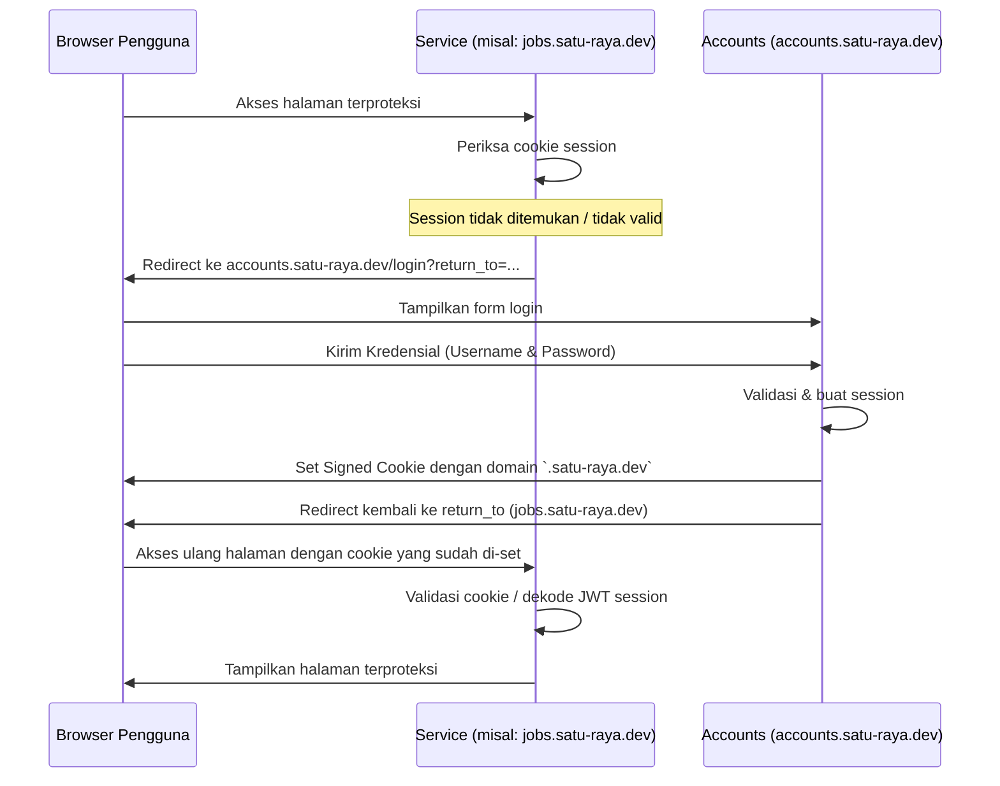
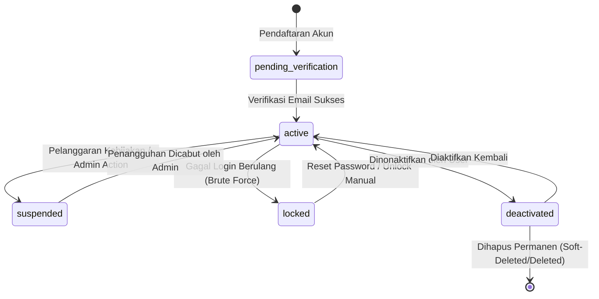

# Arsitektur Akun dan Identity (Accounts/IAM)

Dokumen ini menjelaskan arsitektur tingkat tinggi (high-level architecture) untuk layanan **Satu Raya Accounts (IAM)**, mencakup strategi Single Sign-On (SSO), isolasi multi-tenant, siklus hidup pengguna, dan klasifikasi klien.

---

## 1. Strategi SSO Antar Subdomain

Layanan Accounts bertindak sebagai Identity Provider (IdP) pusat bagi seluruh ekosistem Satu Raya. Untuk memberikan pengalaman pengguna yang mulus tanpa perlu login berulang kali, digunakan mekanisme **Wildcard Signed Cookie** lintas subdomain.

### Skenario Domain
Aplikasi dalam ekosistem menggunakan pembagian subdomain sebagai berikut:
- **Pusat Identitas**: `accounts.satu-raya.dev` (atau domain brand kustom lainnya)
- **Portal Lowongan Kerja (Jobs)**: `jobs.satu-raya.dev`
- **Portal Bisnis/Mitra**: `business.satu-raya.dev`
- **Portal Administrasi**: `admin.satu-raya.dev`

### Alur Autentikasi SSO (Cookie-Based)



### Aturan & Implementasi Cookie
1. **Domain Wildcard**: Cookie session harus disetel menggunakan domain wildcard, contohnya `.satu-raya.dev` (atau `.kacanggoreng.com` pada brand kustom), agar dapat dibaca oleh subdomain lain.
2. **Kustomisasi Domain**: Nilai cookie domain dibaca secara dinamis dari konfigurasi `SatuRayaIdentityClient::Identity::BrandConfig.app_domain` (menggunakan environment variable `APP_DOMAIN`).
3. **Session Cookie Security**: Cookie wajib disetel dengan opsi:
   - `secure: true` (hanya dikirim via HTTPS).
   - `httponly: true` (mencegah pembacaan cookie via Javascript untuk menghindari XSS).
   - `same_site: :lax` (mengizinkan cookie dikirim saat navigasi lintas situs yang aman).

---

## 2. Kebijakan Multi-Tenant (Multi-Tenant Policy)

Satu Raya dirancang sebagai platform multi-tenant yang aman. Accounts harus menjamin isolasi data pengguna secara ketat antar tenant.

### Resolusi Tenant
Tenant ditentukan secara dinamis pada setiap request menggunakan parser domain atau header:
```ruby
# Menentukan tenant aktif dalam request lifecycle
Current.tenant = TenantResolver.from_request(request)
ActsAsTenant.current_tenant = Current.tenant
```

### Aturan Isolasi Data Tenant
1. **Mandatory Scope**: Seluruh query data (terutama ke tabel `users` dan `sessions`) harus memiliki scope `tenant_id` secara eksplisit.
2. **Pencarian Login Unik Per Tenant**: Pencarian email saat login bersifat tenant-scoped. User dengan email `worker@example.com` di Tenant A berbeda dengan `worker@example.com` di Tenant B.
3. **Audit Logging**: Setiap log aktivitas (audit log) wajib mencatat `tenant_id` untuk kepatuhan (compliance).
4. **Token Tenancy**: Setiap token yang diisukan (JWT Access Token atau Introspection payload) wajib menyertakan klaim `tenant_id`.
5. **Cross-Tenant Admin Access**: Admin internal dilarang mengakses tenant lain secara langsung kecuali menggunakan **Cross-Tenant Mode** yang diotorisasi khusus dan dicatat dalam audit log tingkat tinggi.

---

## 3. Boundary Contract & Boundary Mapping Klien

Untuk menjaga agar Accounts murni menjadi service IAM (Identity and Access Management) tanpa tercampur logika bisnis, didefinisikan batas tanggung jawab (coupling boundaries).

```
+-------------------------------------------------------------+
|                     Accounts / IAM Service                  |
|  - Menyimpan kredensial, MFA, session, & global permissions|
+-------------------------------------------------------------+
                              |
                              | [Boundary Contract (JSON/JWT)]
                              v
+-------------------------------------------------------------+
|                      Business Services                      |
|  - Menyimpan profil bisnis, data payroll, lamaran, dll     |
|  - Terhubung ke Accounts via ID Pengguna (UUID)             |
+-------------------------------------------------------------+
```

### Klasifikasi Klien: `sso_client_configurations` vs `api_clients`
Untuk memisahkan akses integrasi, Accounts membedakan dua tipe konfigurasi klien:

1. **`sso_client_configurations` (Single Sign-On / OIDC Clients)**
   - Digunakan oleh internal services (Jobs, Business) atau partner eksternal untuk integrasi Single Sign-On (SSO).
   - Menggunakan alur OAuth2 / OIDC standar (Authorization Code Flow dengan PKCE).
   - Memerlukan persetujuan eksplisit dari pengguna (Consent Screen) saat pertama kali login dan validasi redirect URI yang ketat (allowlist).

2. **`api_clients` (Machine-to-Machine Integration Clients)**
   - Digunakan untuk komunikasi langsung programatik antar-service (Machine-to-Machine/M2M) atau integrasi API backend.
   - Menggunakan autentikasi API Key & Secret (`api_key` dan `api_secret_digest` terenkripsi).
   - Mendukung pembatasan akses IP (`allowed_ips`), hak akses API granular (`permissions` JSONB), dan rate limit per menit (`rate_limit_per_minute`) untuk keamanan optimal.

---

## 4. Siklus Hidup Pengguna (User Lifecycle Status)

Akun pengguna tidak hanya berupa status aktif/tidak aktif (`active: boolean`), melainkan dikelola dengan state machine yang mencerminkan siklus hidup akun pengguna.



### Representasi Kode (Ruby Enum)
Model `Identity::User` merepresentasikan siklus hidup ini melalui Rails enum:
```ruby
class Identity::User < ApplicationRecord
  # Definisi status user lifecycle
  enum :status, {
    pending_verification: 0, # Akun dibuat, menunggu verifikasi email
    active: 1,               # Akun aktif dan dapat digunakan
    suspended: 2,            # Akun ditangguhkan oleh administrator
    locked: 3,               # Akun terkunci sementara karena brute-force login
    deactivated: 4           # Akun dinonaktifkan atas permintaan user
  }, default: :pending_verification
end
```

---

## Dokumen Terkait
- [API Contracts](API-CONTRACT.md)
- [Event Contracts](EVENT-CONTRACT.md)
- [Security Specifications](SECURITY.md)
- [Implementation Roadmap](ROADMAP.md)
