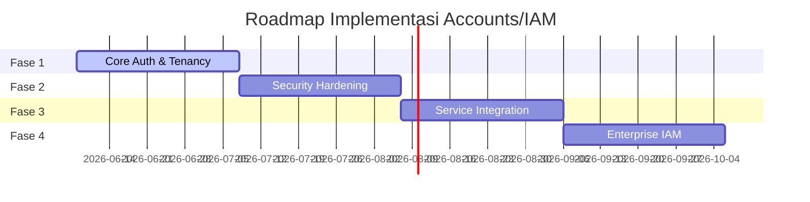

# Roadmap Implementasi (ROADMAP)

Dokumen ini menjelaskan peta jalan (roadmap) pembangunan layanan **Satu Raya Accounts (IAM)** yang dibagi menjadi empat fase utama untuk memastikan stabilitas dan keamanan sebelum integrasi ekosistem.

---

## Peta Jalan Pembangunan



---

## Detail Fase Implementasi

### 1. Fase 1 — Core Auth & Tenancy
Fokus utama fase ini adalah membangun fondasi autentikasi dasar dan pemisahan data penyewa (multi-tenancy) yang solid.

- [x] **Tenant Resolver**: Implementasi logika penentuan tenant aktif (`Current.tenant`) berdasarkan request host/subdomain secara dinamis.
- [x] **Registrasi & Verifikasi**: Form pendaftaran pengguna baru dilengkapi dengan alur pengiriman email verifikasi (Email Verification).
- [x] **Login & Logout**: Autentikasi berbasis session menggunakan Rails cookie.
- [x] **Session Management**: Halaman dashboard akun untuk menampilkan status login aktif dan logout per perangkat.
- [x] **Password Reset**: Alur pemulihan akun melalui token yang dikirim ke email (Forgot Password).
- [x] **Audit Log Dasar**: Pencatatan riwayat login sukses dan gagal tingkat dasar.

---

### 2. Fase 2 — Security Hardening
Meningkatkan pertahanan layanan identitas dari berbagai ancaman keamanan eksternal.

- [x] **Login Attempt & Account Lock**: Sistem penguncian akun sementara setelah kegagalan login berulang (terkunci setelah 5 kali gagal).
- [x] **2FA TOTP**: Pendaftaran dan verifikasi langkah kedua menggunakan OTP berbasis waktu (Google Authenticator / Microsoft Authenticator).
- [x] **Backup/Recovery Codes**: Mekanisme pembuatan kode pemulihan darurat sekali pakai jika pengguna kehilangan akses TOTP.
- [x] **Trusted Device**: Opsi "Ingat Perangkat Ini" untuk melewati tantangan MFA pada perangkat tepercaya.
- [x] **Password History**: Validasi agar pengguna tidak mengganti password dengan nilai lama yang sudah pernah digunakan.
- [x] **Rack::Attack Integration**: Proteksi anti-DDOS dan brute-force di tingkat Rack middleware untuk membatasi rate limit request.

---

### 3. Fase 3 — Integration & Federation
Fase ini mempersiapkan Accounts agar dapat terhubung dengan service internal monorepo lainnya secara aman.

- [x] **JWT Issuance**: Implementasi penerbitan JWT Access Token yang berisi klaim data user minimal, peran, dan tenant scope.
- [x] **SSO Cookie Federation**: Hardening sharing session cookie lintas domain wildcard `.satu-raya.dev`.
- [x] **Service Client Autentikasi**: Pembuatan tabel `service_clients` untuk menampung kredensial komunikasi M2M (Machine-to-Machine) antar-service.
- [x] **Token Introspection API**: Endpoint internal `/oauth/introspect` untuk validasi status token dari microservice lain.
- [x] **HMAC User Sync Event**: Penerbitan event perubahan status identitas (misal: `identity.user.updated`) bertanda tangan HMAC.
- [x] **Consent Screen**: Halaman persetujuan otorisasi data (scope approval) saat aplikasi klien meminta akses profil user.

---

### 4. Fase 4 — Enterprise IAM
Menambahkan fitur lanjutan untuk memenuhi skala komersial dan kebutuhan integrasi tingkat enterprise.

- [x] **Passkeys & WebAuthn**: Autentikasi modern tanpa password menggunakan biometrik (didukung dengan database tabel `user_passkeys`).
- [x] **Full OAuth2 / OIDC Provider**: Mendukung penuh standar OpenID Connect agar Accounts dapat digunakan sebagai sistem masuk tunggal pihak ketiga (Login with Satu Raya) dengan OIDC Discovery (`.well-known/openid-configuration`) dan JWKS keys endpoint.
- [x] **Refresh Token Rotation (RTR)**: Rotasi refresh token otomatis dan deteksi replay attack menggunakan tabel `jwt_refresh_tokens` untuk meningkatkan keamanan federasi token.
- [x] **Fine-Grained Permissions**: Manajemen hak akses granular berbasis RBAC (Role-Based Access Control) yang dinamis per tenant (melalui tabel `roles`, `user_roles`, `permissions`, `role_permissions`, dan `user_permissions`).
- [x] **Admin Audit Dashboard & Integrity Check**: Verifikasi integritas audit trail menggunakan cryptographic hash chain melalui rake task verification.
- [x] **Risk Scoring**: Analisis keamanan mendeteksi pola login mencurigakan untuk memicu tantangan MFA paksa.

---

## 5. Background Jobs & Rake Tasks

Accounts menyertakan beberapa background jobs otomatis dan perintah operasional (CLI/Rake task):

### Scheduled Jobs (Solid Queue)
Konfigurasi terjadwal berjalan secara reguler (ditentukan di `config/recurring.yml`):
1. **`Identity::ExpiredTokenCleanupJob`**
   - **Jadwal**: Setiap 1 jam (`every hour`).
   - **Tujuan**: Menghapus token email verification dan password reset yang sudah kadaluarsa secara otomatis dari database.
2. **`Communication::WebhookRetryJob`**
   - **Jadwal**: Setiap 5 menit (`every 5 minutes`).
   - **Tujuan**: Membaca webhook deliveries dengan status `failed` dan menjadwalkan ulang pengiriman menggunakan strategi exponential backoff.

### Operasional & Kepatuhan (Compliance)
1. **Audit Log Integrity Verification**:
   ```bash
   bin/rails system:audit:verify
   ```
   - **Tujuan**: Memverifikasi validitas rantai hash (hash chain) audit logs di seluruh tenant secara kronologis untuk memastikan tidak terjadi modifikasi/tampering data log secara ilegal.

---

## Dokumen Terkait
- [Architecture Overview](ARCHITECTURE.md)
- [API Contracts](API-CONTRACT.md)
- [Event Contracts](EVENT-CONTRACT.md)
- [Security Specifications](SECURITY.md)
