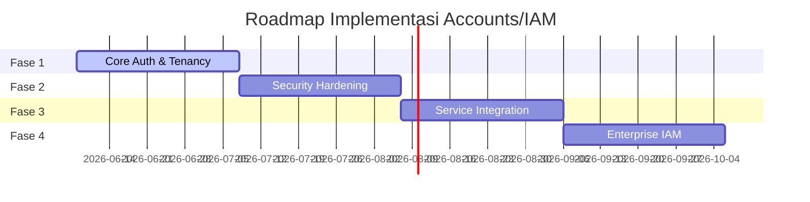

# Roadmap Implementasi (ROADMAP)

Dokumen ini menjelaskan peta jalan (roadmap) pembangunan layanan **Satu Raya Accounts (IAM)** yang dibagi menjadi empat fase utama untuk memastikan stabilitas dan keamanan sebelum integrasi ekosistem.

---

## Peta Jalan Pembangunan

---

## Detail Fase Implementasi

### 1. Fase 1 — Core Auth & Tenancy
Fokus utama fase ini adalah membangun fondasi autentikasi dasar dan pemisahan data penyewa (multi-tenancy) yang solid.

- [ ] **Tenant Resolver**: Implementasi logika penentuan tenant aktif (`Current.tenant`) berdasarkan request host/subdomain secara dinamis.
- [ ] **Registrasi & Verifikasi**: Form pendaftaran pengguna baru dilengkapi dengan alur pengiriman email verifikasi (Email Verification).
- [ ] **Login & Logout**: Autentikasi berbasis session menggunakan Rails cookie.
- [ ] **Session Management**: Halaman dashboard akun untuk menampilkan status login aktif dan logout per perangkat.
- [ ] **Password Reset**: Alur pemulihan akun melalui token yang dikirim ke email (Forgot Password).
- [ ] **Audit Log Dasar**: Pencatatan riwayat login sukses dan gagal tingkat dasar.

---

### 2. Fase 2 — Security Hardening
Meningkatkan pertahanan layanan identitas dari berbagai ancaman keamanan eksternal.

- [ ] **Login Attempt & Account Lock**: Sistem penguncian akun sementara setelah kegagalan login berulang (misal: terkunci setelah 5 kali gagal).
- [ ] **2FA TOTP**: Pendaftaran dan verifikasi langkah kedua menggunakan OTP berbasis waktu (Google Authenticator / Microsoft Authenticator).
- [ ] **Backup/Recovery Codes**: Mekanisme pembuatan kode pemulihan darurat sekali pakai jika pengguna kehilangan akses TOTP.
- [ ] **Trusted Device**: Opsi "Ingat Perangkat Ini" untuk melewati tantangan MFA pada perangkat tepercaya.
- [ ] **Password History**: Validasi agar pengguna tidak mengganti password dengan nilai lama yang sudah pernah digunakan.
- [ ] **Rack::Attack Integration**: Proteksi anti-DDOS dan brute-force di tingkat Rack middleware untuk membatasi rate limit request.

---

### 3. Fase 3 — Integration & Federation
Fase ini mempersiapkan Accounts agar dapat terhubung dengan service internal monorepo lainnya secara aman.

- [ ] **JWT Issuance**: Implementasi penerbitan JWT Access Token yang berisi klaim data user minimal, peran, dan tenant scope.
- [ ] **SSO Cookie Federation**: Hardening sharing session cookie lintas domain wildcard `.satu-raya.dev`.
- [ ] **Service Client Autentikasi**: Pembuatan tabel `service_clients` untuk menampung kredensial komunikasi M2M (Machine-to-Machine) antar-service.
- [ ] **Token Introspection API**: Endpoint internal `/oauth/introspect` untuk validasi status token dari microservice lain.
- [ ] **HMAC User Sync Event**: Penerbitan event perubahan status identitas (misal: `identity.user.updated`) bertanda tangan HMAC.
- [ ] **Consent Screen**: Halaman persetujuan otorisasi data (scope approval) saat aplikasi klien meminta akses profil user.

---

### 4. Fase 4 — Enterprise IAM
Menambahkan fitur lanjutan untuk memenuhi skala komersial dan kebutuhan integrasi tingkat enterprise.

- [ ] **Passkeys & WebAuthn**: Autentikasi modern tanpa password menggunakan biometrik (Windows Hello, FaceID, TouchID).
- [ ] **Full OAuth2 / OIDC Provider**: Mendukung penuh standar OpenID Connect agar Accounts dapat digunakan sebagai sistem masuk tunggal pihak ketiga (Login with Satu Raya).
- [ ] **Fine-Grained Permissions**: Manajemen hak akses granular berbasis RBAC (Role-Based Access Control) yang dinamis per tenant.
- [ ] **Admin Audit Dashboard**: Dashboard terpusat bagi super admin untuk memantau logs kepatuhan, rotasi secret, dan pola login tidak wajar.
- [ ] **Risk Scoring**: Analisis keamanan mendeteksi pola login mencurigakan (misal: perbedaan geografis login dalam waktu singkat) untuk memicu tantangan MFA paksa.

---

## Dokumen Terkait
- [Architecture Overview](ARCHITECTURE.md)
- [API Contracts](API-CONTRACT.md)
- [Event Contracts](EVENT-CONTRACT.md)
- [Security Specifications](SECURITY.md)
