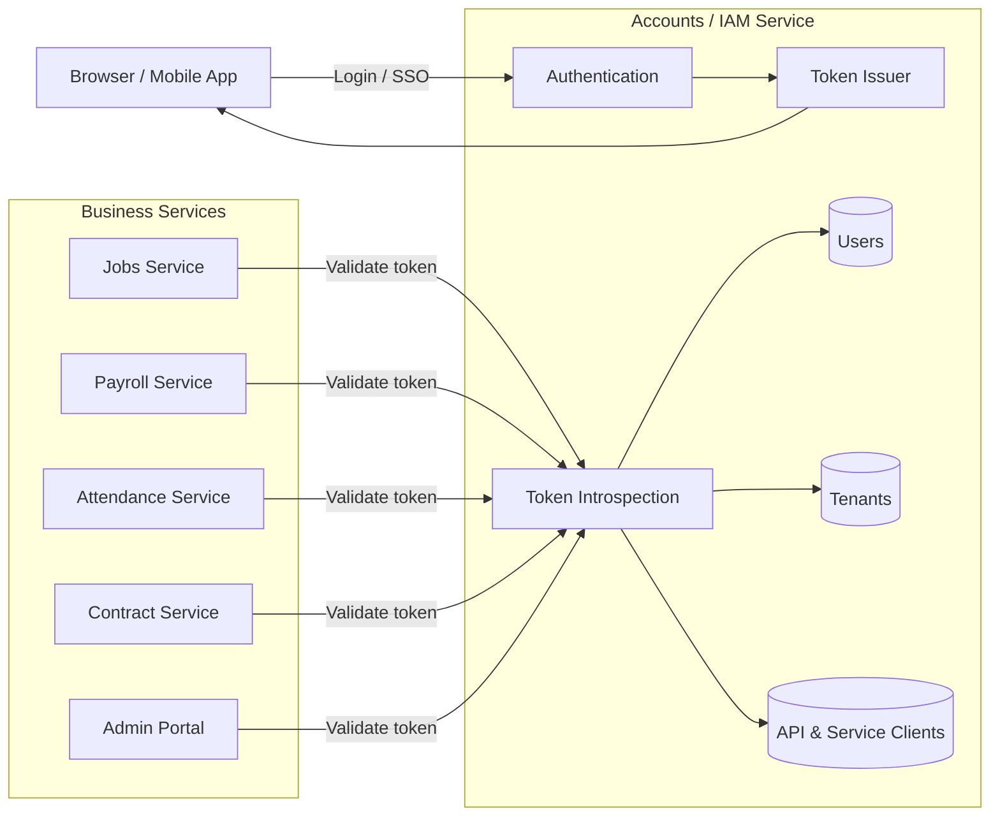
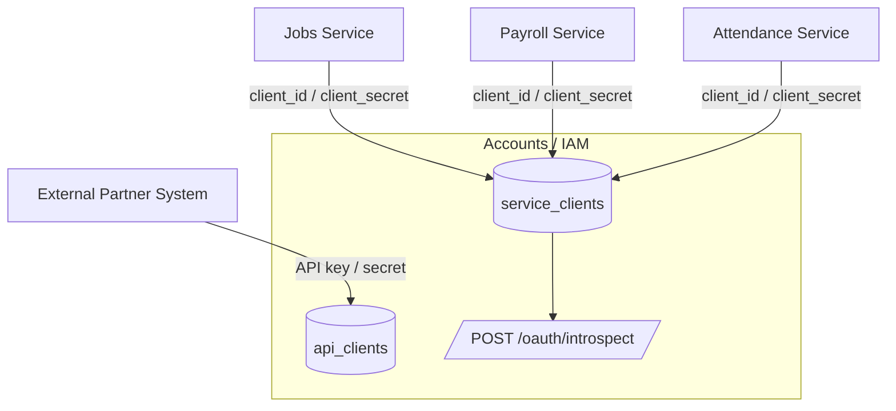
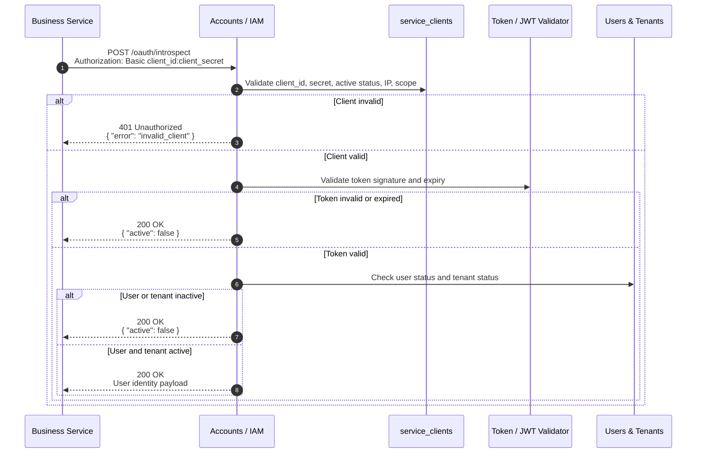
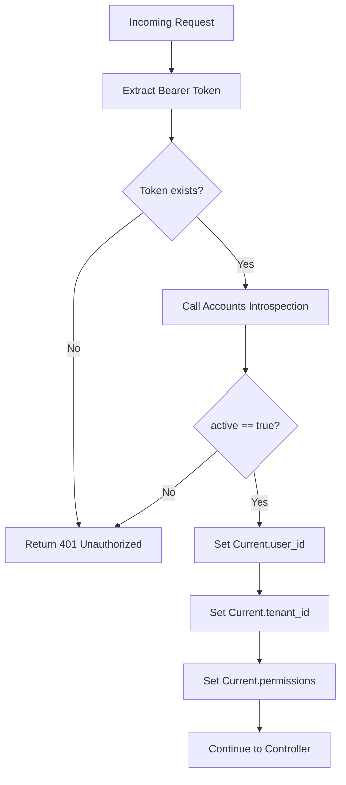

# API Contract & Data Integration

**Service**: Satu Raya Accounts / IAM  
**Document Type**: API Contract Specification  
**Audience**: Backend Developer, Frontend Developer, DevOps, Security Engineer  
**Status**: Draft for Implementation  
**Last Updated**: 2026-06-11

---

## 1. Overview

Dokumen ini mendefinisikan kontrak teknis untuk pertukaran data antara **Satu Raya Accounts / IAM** dengan service lain di ekosistem Satu Raya, seperti Jobs, Payroll, Attendance, Contract, Business Portal, dan Admin Portal.

Tujuan utama dokumen ini adalah memastikan setiap service dapat berintegrasi dengan Accounts secara konsisten, aman, dan tidak bergantung langsung pada struktur internal database IAM.

Accounts bertanggung jawab untuk:

- autentikasi pengguna;
- validasi access token;
- penerbitan identitas pengguna minimal;
- manajemen role dan permission;
- autentikasi service-to-service;
- validasi status user dan tenant;
- audit integrasi antar-service.

Business service **tidak boleh** membaca tabel internal Accounts secara langsung, termasuk tabel `users`, `sessions`, `tenants`, `mfa_*`, atau `password_*`.

---

## 2. Design Principles

| Prinsip | Penjelasan |
| --- | --- |
| Loose Coupling | Service lain hanya mengonsumsi kontrak API, bukan tabel internal Accounts. |
| Tenant Isolation | Semua response identitas wajib membawa `tenant_id`. |
| Least Privilege | Client hanya mendapatkan scope dan permission yang diperlukan. |
| Explicit Contract | Payload harus stabil, terdokumentasi, dan backward-compatible. |
| Centralized Validation | Validasi token dilakukan melalui Accounts sebagai authority. |
| Secure by Default | Secret tidak pernah disimpan plain text dan akses M2M wajib dibatasi. |

---

## 3. Integration Context

Diagram berikut menunjukkan posisi Accounts sebagai identity authority di antara business services.



**Catatan penting:** Business service hanya boleh menyimpan referensi `user_id` dan `tenant_id`, bukan menyalin credential atau data sensitif dari Accounts.

---

## 4. Boundary Contract: User Profile Payload

Boundary contract adalah payload identitas minimal yang boleh dikonsumsi oleh service lain. Payload ini digunakan agar service seperti Jobs, Payroll, Attendance, dan Contract tidak perlu mengetahui struktur tabel `users` milik Accounts.

### 4.1 User Profile Schema

```json
{
  "user_id": "9f1b98b6-98df-45a8-92c9-12f86db3065b",
  "tenant_id": "c62db73b-b27b-4db4-bfa2-35db4db8b8cb",
  "email": "pekerja@satu-raya.dev",
  "role": "worker",
  "permissions": [
    "jobs.apply",
    "contracts.read"
  ],
  "verified": true,
  "active": true
}
```

### 4.2 Field Definition

| Field | Type | Required | Description |
| --- | --- | --- | --- |
| `user_id` | UUID | Yes | Identifier global pengguna dari Accounts. |
| `tenant_id` | UUID | Yes | Identifier tenant tempat pengguna berada. |
| `email` | String | Yes | Email utama pengguna. Untuk login, email tetap harus dianggap tenant-scoped. |
| `role` | String | Yes | Role utama pengguna, misalnya `worker`, `employer`, `tenant_admin`, atau `super_admin`. |
| `permissions` | Array[String] | Yes | Permission granular yang diberikan kepada user. |
| `verified` | Boolean | Yes | Status verifikasi email. |
| `active` | Boolean | Yes | Status fungsional akun. `false` berarti user tidak boleh mengakses service. |

### 4.3 Allowed Usage by Business Service

| Data | Boleh Disimpan di Business Service? | Catatan |
| --- | --- | --- |
| `user_id` | Yes | Digunakan sebagai foreign reference ke user Accounts. |
| `tenant_id` | Yes | Wajib untuk tenant scoping. |
| `role` | Yes, sebagai cache terbatas | Harus dianggap data turunan dari Accounts. |
| `permissions` | Yes, sebagai cache terbatas | Harus divalidasi ulang secara berkala atau saat request penting. |
| `email` | Optional | Hindari menjadi sumber kebenaran utama. |
| password / MFA / session secret | No | Tidak boleh keluar dari Accounts. |

---

## 5. Machine-to-Machine Client Model

Accounts membedakan dua jenis client untuk integrasi programatik.

| Client Type | Table | Purpose | Typical Consumer |
| --- | --- | --- | --- |
| Public / External API Client | `api_clients` | Integrasi partner, webhook, atau API publik terbatas. | Partner eksternal, sistem pihak ketiga. |
| Internal Service Client | `service_clients` | Komunikasi antar-service internal Satu Raya. | Jobs, Payroll, Attendance, Contract. |

### 5.1 Client Classification Diagram



---

## 6. `service_clients` Table Specification

Tabel `service_clients` digunakan untuk autentikasi antar-service internal.

| Field | Type | Nullable | Description |
| --- | --- | --- | --- |
| `id` | UUID | No | Primary key. |
| `tenant_id` | UUID | Yes | Jika `null`, client berlaku global/system-wide. Jika terisi, client hanya berlaku untuk tenant tertentu. |
| `service_name` | String | No | Nama service internal, misalnya `jobs-service` atau `payroll-service`. |
| `client_id` | String | No | Public identifier untuk client. Harus unik secara global. |
| `secret_digest` | String | No | Digest dari client secret. Secret asli tidak boleh disimpan plain text. |
| `allowed_scopes` | Array[String] | No | Daftar scope yang boleh digunakan client. Contoh: `introspect`, `user.read`, `user.sync`. |
| `allowed_ips` | Array[String] | No | IP allowlist untuk membatasi akses dari jaringan internal. |
| `active` | Boolean | No | Menandakan client aktif atau nonaktif. Default: `true`. |
| `rotated_at` | DateTime | Yes | Waktu terakhir secret dirotasi. |
| `created_at` | DateTime | No | Waktu record dibuat. |
| `updated_at` | DateTime | No | Waktu record terakhir diperbarui. |

### 6.1 Recommended Indexes

```ruby
add_index :service_clients, :client_id, unique: true
add_index :service_clients, [:tenant_id, :service_name]
add_index :service_clients, :active
```

### 6.2 Recommended Scope Names

| Scope | Description |
| --- | --- |
| `introspect` | Mengizinkan client memanggil token introspection endpoint. |
| `user.read` | Mengizinkan client membaca user profile minimal. |
| `user.sync` | Mengizinkan client menerima atau memproses event sinkronisasi user. |
| `tenant.read` | Mengizinkan client membaca metadata tenant minimal. |

---

## 7. Token Introspection Endpoint

Token introspection endpoint digunakan oleh service internal untuk memvalidasi access token secara terpusat.

Endpoint ini bertugas untuk:

1. memvalidasi autentikasi service client;
2. memvalidasi format dan signature token;
3. memastikan token belum kedaluwarsa;
4. memastikan user masih aktif;
5. memastikan tenant masih aktif;
6. mengembalikan metadata otorisasi minimal.

---

## 8. Introspection Request Flow



---

## 9. HTTP Contract: Token Introspection

### 9.1 Request

| Property | Value |
| --- | --- |
| Endpoint | `/oauth/introspect` |
| Method | `POST` |
| Authentication | HTTP Basic Auth using `client_id:client_secret` |
| Content-Type | `application/x-www-form-urlencoded` or `application/json` |

### 9.2 Headers

```http
Authorization: Basic <base64(client_id:client_secret)>
Content-Type: application/x-www-form-urlencoded
```

### 9.3 Request Body

| Parameter | Type | Required | Description |
| --- | --- | --- | --- |
| `token` | String | Yes | Access token or JWT to validate. |

### 9.4 Example Request

```bash
curl -X POST https://accounts.satu-raya.dev/oauth/introspect \
  -H "Authorization: Basic <base64(client_id:client_secret)>" \
  -H "Content-Type: application/x-www-form-urlencoded" \
  -d "token=jwt.access.token.here"
```

---

## 10. HTTP Responses

### 10.1 Valid Token

**Status Code:** `200 OK`  
**Content-Type:** `application/json`

```json
{
  "active": true,
  "user_id": "9f1b98b6-98df-45a8-92c9-12f86db3065b",
  "tenant_id": "c62db73b-b27b-4db4-bfa2-35db4db8b8cb",
  "role": "worker",
  "permissions": [
    "jobs.apply",
    "contracts.read"
  ],
  "expires_at": "2026-06-08T12:00:00Z"
}
```

### 10.2 Invalid, Expired, Revoked, or Inactive Token

**Status Code:** `200 OK`  
**Content-Type:** `application/json`

```json
{
  "active": false
}
```

Response `active: false` digunakan untuk kondisi berikut:

- token tidak valid;
- token kedaluwarsa;
- token sudah dicabut;
- user tidak aktif;
- user terkunci;
- tenant tidak aktif;
- token tidak sesuai tenant yang sedang diminta.

### 10.3 Invalid Service Client

**Status Code:** `401 Unauthorized`  
**Content-Type:** `application/json`

```json
{
  "error": "invalid_client"
}
```

Kondisi ini terjadi jika:

- `client_id` tidak ditemukan;
- `client_secret` salah;
- client tidak aktif;
- IP request tidak masuk `allowed_ips`;
- client tidak memiliki scope `introspect`.

---

## 11. Recommended Validation Logic

Pseudo-code berikut dapat digunakan sebagai acuan implementasi controller introspection.

```ruby
class Oauth::IntrospectionController < ApplicationController
  skip_before_action :verify_authenticity_token

  def create
    service_client = authenticate_service_client!
    return render_invalid_client unless service_client&.allowed_scope?("introspect")

    token = params[:token].to_s
    payload = TokenVerifier.verify(token)

    return render_inactive unless payload.valid?

    user = Identity::User.find_by(id: payload.user_id, tenant_id: payload.tenant_id)
    tenant = Tenant.find_by(id: payload.tenant_id)

    return render_inactive unless user&.active?
    return render_inactive unless tenant&.active?

    render json: {
      active: true,
      user_id: user.id,
      tenant_id: tenant.id,
      role: user.role,
      permissions: user.effective_permissions,
      expires_at: payload.expires_at.iso8601
    }
  end

  private

  def render_inactive
    render json: { active: false }, status: :ok
  end

  def render_invalid_client
    render json: { error: "invalid_client" }, status: :unauthorized
  end
end
```

---

## 12. Consumer Implementation Guide

Business service sebaiknya memiliki middleware untuk memvalidasi token sebelum request diproses.



### 12.1 Example Consumer Middleware

```ruby
class AuthenticateWithAccounts
  def initialize(app)
    @app = app
  end

  def call(env)
    request = Rack::Request.new(env)
    token = request.get_header("HTTP_AUTHORIZATION").to_s.delete_prefix("Bearer ")

    return unauthorized if token.empty?

    identity = AccountsClient.introspect(token)
    return unauthorized unless identity["active"] == true

    Current.user_id = identity["user_id"]
    Current.tenant_id = identity["tenant_id"]
    Current.permissions = identity["permissions"]

    @app.call(env)
  end

  private

  def unauthorized
    [401, { "Content-Type" => "application/json" }, [{ error: "unauthorized" }.to_json]]
  end
end
```

---

## 13. Error Handling Policy

| Scenario | HTTP Status | Body | Notes |
| --- | --- | --- | --- |
| Missing bearer token in business service | `401` | `{ "error": "unauthorized" }` | Ditangani oleh business service. |
| Invalid service client | `401` | `{ "error": "invalid_client" }` | Ditangani oleh Accounts. |
| Invalid user token | `200` | `{ "active": false }` | Sesuai pola token introspection. |
| Expired user token | `200` | `{ "active": false }` | Consumer harus menolak akses. |
| Tenant inactive | `200` | `{ "active": false }` | Consumer tidak perlu tahu alasan detail. |
| Accounts unavailable | `503` di consumer | `{ "error": "identity_service_unavailable" }` | Business service boleh fail-closed. |

---

## 14. Security Requirements

| Requirement | Recommendation |
| --- | --- |
| Secret Storage | Simpan hanya `secret_digest`, bukan secret asli. |
| Secret Rotation | Rotasi secret secara berkala dan catat `rotated_at`. |
| Transport Security | Semua request wajib HTTPS. |
| IP Restriction | Internal client wajib menggunakan `allowed_ips`. |
| Scope Enforcement | Endpoint introspection wajib memeriksa scope `introspect`. |
| Audit Log | Catat client, IP, tenant, user, result, dan request ID. |
| Rate Limit | Terapkan rate limit per `client_id`. |
| Fail Closed | Jika Accounts tidak dapat dihubungi, consumer harus menolak request sensitif. |
| No Sensitive Detail | Response `active: false` tidak boleh membocorkan alasan detail ke consumer. |

---

## 15. Audit Log Recommendation

Setiap request introspection sebaiknya menghasilkan audit log internal.

```json
{
  "event": "oauth.token_introspection",
  "client_id": "jobs-service",
  "service_name": "jobs-service",
  "tenant_id": "c62db73b-b27b-4db4-bfa2-35db4db8b8cb",
  "user_id": "9f1b98b6-98df-45a8-92c9-12f86db3065b",
  "result": "active",
  "remote_ip": "10.10.1.20",
  "request_id": "req_01HXABCDEF",
  "created_at": "2026-06-08T12:00:00Z"
}
```

---

## 16. Versioning Policy

API contract harus menjaga backward compatibility.

| Change Type | Allowed Without Version Bump? | Example |
| --- | --- | --- |
| Add optional field | Yes | Menambah `display_name`. |
| Remove field | No | Menghapus `tenant_id`. |
| Rename field | No | Mengubah `user_id` menjadi `id`. |
| Change type | No | Mengubah `permissions` dari array menjadi string. |
| Add new endpoint | Yes | Menambah `/oauth/userinfo`. |

Jika perubahan breaking diperlukan, gunakan versi endpoint baru, misalnya:

```http
POST /v2/oauth/introspect
```

---

## 17. Implementation Checklist

- [ ] Buat tabel `service_clients`.
- [ ] Tambahkan unique index untuk `client_id`.
- [ ] Simpan client secret dalam bentuk digest.
- [ ] Implementasikan Basic Auth untuk service client.
- [ ] Implementasikan scope check `introspect`.
- [ ] Implementasikan token verifier.
- [ ] Validasi status user dan tenant.
- [ ] Tambahkan audit log introspection.
- [ ] Tambahkan rate limit per client.
- [ ] Tambahkan middleware consumer di business services.
- [ ] Tambahkan integration test untuk valid, invalid, expired, revoked, inactive tenant, dan invalid client.

---

## 18. Related Documents

- [Architecture Overview](ARCHITECTURE.md)
- [Event Contracts](EVENT-CONTRACT.md)
- [Security Specifications](SECURITY.md)
- [Implementation Roadmap](ROADMAP.md)
