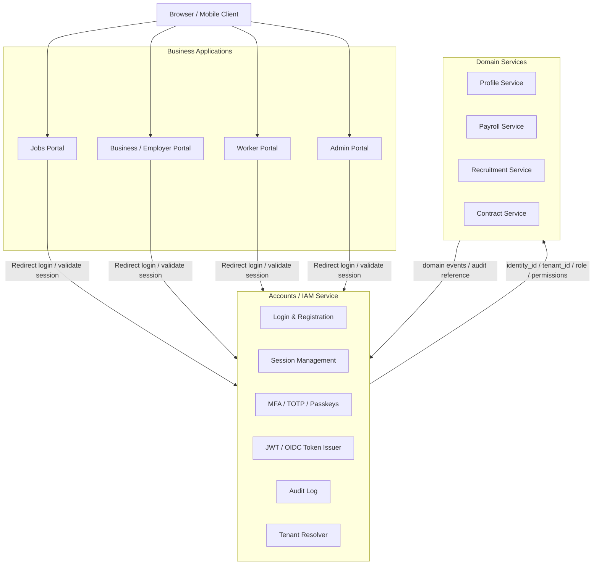
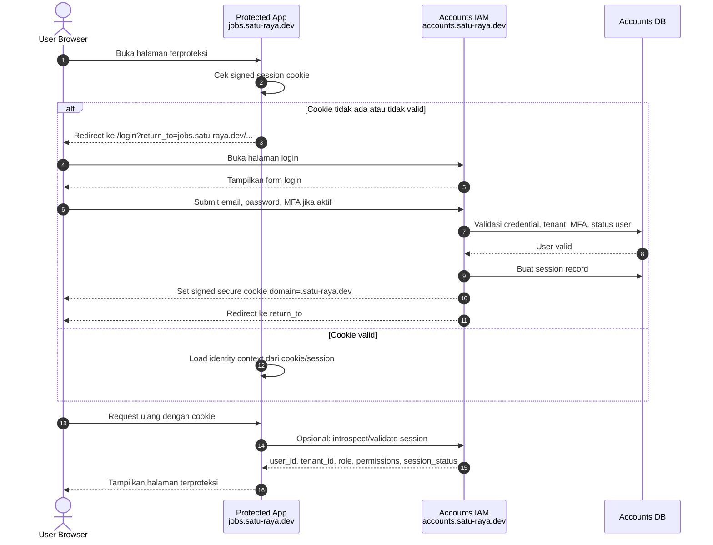
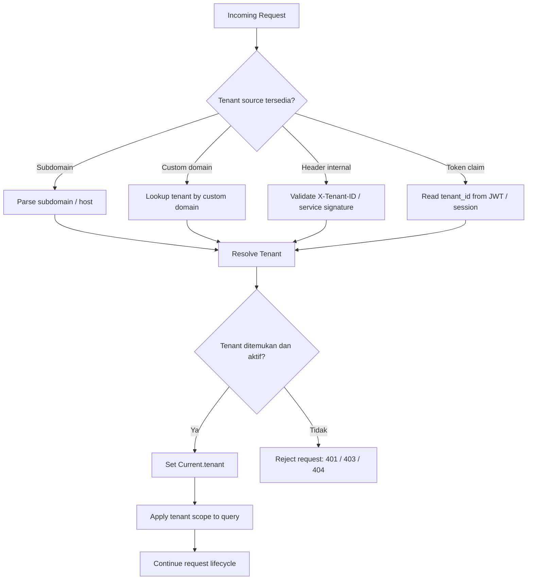
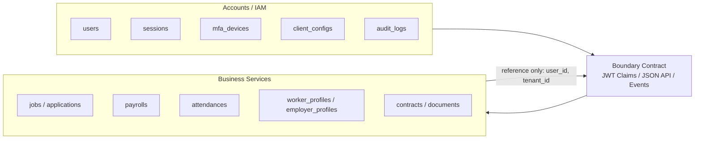
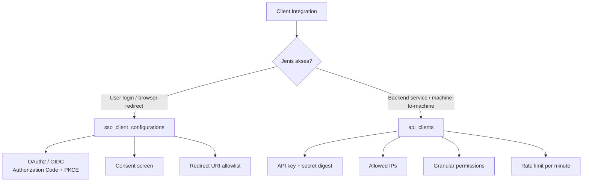
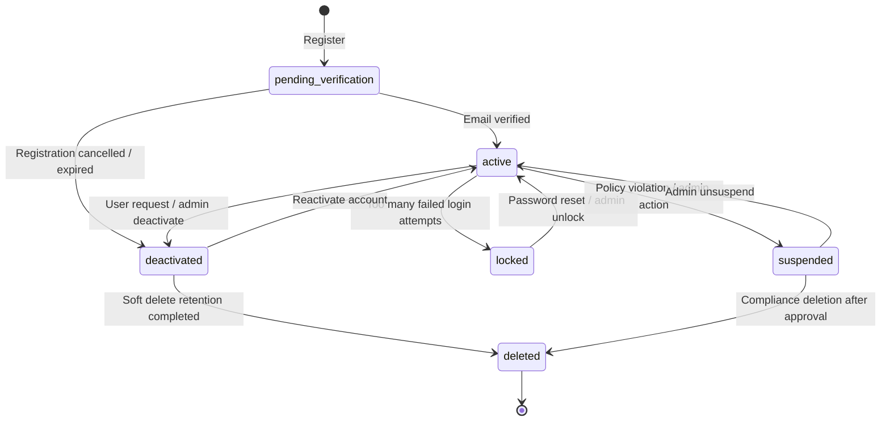
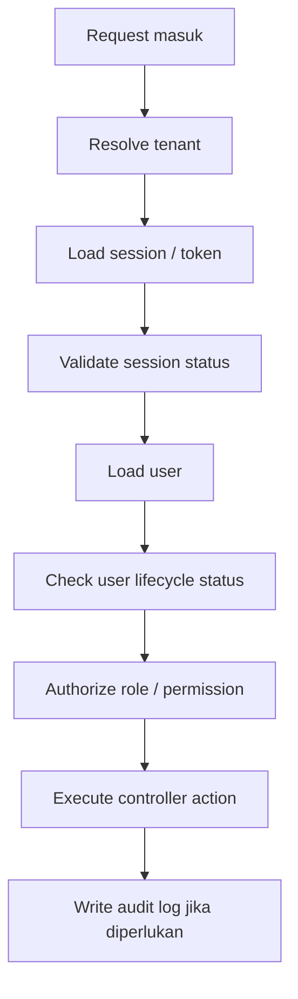

# Accounts / IAM Architecture

**Project:** Satu Raya Accounts  
**Service:** Identity and Access Management (IAM)  
**Status:** Architecture Draft  
**Audience:** Backend Developer, Platform Engineer, Security Engineer, DevOps  

---

## 1. Ringkasan

Satu Raya Accounts adalah layanan pusat untuk **Identity and Access Management (IAM)** di ekosistem Satu Raya. Service ini bertanggung jawab atas autentikasi, session, Single Sign-On (SSO), Multi-Factor Authentication (MFA), tenant resolution, token issuance, audit log, dan konfigurasi client integrasi.

Dokumen ini menjelaskan batas tanggung jawab Accounts/IAM, strategi SSO antar subdomain, kebijakan multi-tenant, klasifikasi client, serta siklus hidup akun pengguna.

### Tujuan Utama

- Menyediakan **Single Sign-On** antar service internal Satu Raya.
- Menjaga **isolasi data antar tenant** secara ketat.
- Memisahkan tanggung jawab IAM dari business domain seperti job, payroll, contract, profile, dan attendance.
- Menyediakan kontrak integrasi yang jelas untuk frontend, backend service, dan machine-to-machine client.
- Membuat arsitektur mudah dipahami dan diimplementasikan oleh developer lain.

---

## 2. Prinsip Arsitektur

| Prinsip | Penjelasan |
|---|---|
| IAM sebagai pusat identitas | Accounts menjadi Identity Provider utama untuk seluruh service Satu Raya. |
| Tenant isolation by default | Semua akses data user, session, token, dan audit wajib tenant-scoped. |
| Business logic berada di service domain | Accounts tidak menyimpan data payroll, lamaran, kontrak kerja, attendance, atau profil bisnis detail. |
| Secure by default | Cookie, token, API key, MFA, dan audit log wajib mengikuti standar keamanan production. |
| Contract-first integration | Integrasi antar service menggunakan kontrak eksplisit berupa JWT claim, JSON payload, event, atau API contract. |

---

## 3. High-Level System Context

Diagram berikut menunjukkan posisi Accounts/IAM sebagai pusat identitas, sedangkan service lain hanya mengonsumsi identity context dari Accounts.



### Catatan Implementasi

- Accounts menyimpan identitas global user, credential, session, MFA, passkey, consent, client config, dan audit log.
- Business service menyimpan data domain masing-masing, misalnya job application, payroll, profile, contract, document, dan attendance.
- Integrasi antar service menggunakan `user_id`, `tenant_id`, `role`, `permissions`, dan claim tambahan yang disepakati dalam API contract.

---

## 4. Domain dan Subdomain

Aplikasi dalam ekosistem Satu Raya menggunakan pembagian subdomain sebagai berikut:

| Service | Domain Contoh | Fungsi |
|---|---|---|
| Accounts / IAM | `accounts.satu-raya.dev` | Login, register, MFA, session, token, consent |
| Jobs Portal | `jobs.satu-raya.dev` | Portal lowongan kerja dan aplikasi kandidat |
| Business Portal | `business.satu-raya.dev` | Portal perusahaan, HR, payroll, kontrak |
| Worker Portal | `worker.satu-raya.dev` | Portal pekerja, absensi, dokumen, payroll |
| Admin Portal | `admin.satu-raya.dev` | Operasional internal, tenant admin, compliance |

Untuk brand custom, root domain dapat diganti melalui konfigurasi environment, misalnya:

```env
APP_DOMAIN=satu-raya.dev
ACCOUNTS_HOST=accounts.satu-raya.dev
```

---

## 5. Strategi SSO Antar Subdomain

Accounts bertindak sebagai **Identity Provider (IdP)** pusat. Untuk pengalaman login yang mulus antar subdomain, service menggunakan **shared signed session cookie** pada root domain.

Contoh cookie domain:

```text
.satu-raya.dev
```

Dengan konfigurasi ini, cookie dapat dibaca oleh:

- `accounts.satu-raya.dev`
- `jobs.satu-raya.dev`
- `business.satu-raya.dev`
- `worker.satu-raya.dev`
- `admin.satu-raya.dev`

> Catatan: Untuk integrasi eksternal lintas domain yang berbeda sepenuhnya, gunakan OIDC Authorization Code Flow + PKCE, bukan shared cookie.

---

## 6. Alur SSO Cookie-Based



### Aturan Cookie Production

Cookie session wajib menggunakan konfigurasi berikut:

| Opsi | Nilai | Tujuan |
|---|---:|---|
| `domain` | `.satu-raya.dev` atau root domain brand | Agar cookie tersedia di subdomain yang sama |
| `secure` | `true` | Cookie hanya dikirim melalui HTTPS |
| `httponly` | `true` | Cookie tidak dapat dibaca JavaScript |
| `same_site` | `:lax` | Aman untuk navigasi normal antar subdomain |
| `signed` / `encrypted` | `true` | Mencegah manipulasi isi cookie |
| `expires` | sesuai policy session | Mengontrol masa aktif session |

Contoh konfigurasi konseptual:

```ruby
cookies.signed[:satu_raya_session] = {
  value: session_token,
  domain: ".#{ENV.fetch('APP_DOMAIN')}",
  secure: Rails.env.production?,
  httponly: true,
  same_site: :lax,
  expires: 12.hours.from_now
}
```

---

## 7. Multi-Tenant Policy

Satu Raya adalah platform multi-tenant. Karena itu, Accounts wajib memastikan setiap request selalu memiliki tenant context yang benar sebelum melakukan operasi terhadap user, session, token, atau audit log.

### Tenant Resolution Flow



Contoh implementasi:

```ruby
class ApplicationController < ActionController::Base
  before_action :set_current_tenant

  private

  def set_current_tenant
    Current.tenant = TenantResolver.from_request(request)
    raise TenantNotFoundError unless Current.tenant&.active?

    ActsAsTenant.current_tenant = Current.tenant
  end
end
```

### Aturan Isolasi Data

| Area | Aturan |
|---|---|
| Query user | Semua query ke `users` wajib menggunakan `tenant_id`. |
| Query session | Semua query ke `sessions` wajib menggunakan `tenant_id` dan `user_id`. |
| Login email | Email unik di dalam tenant, bukan global. |
| Token | JWT dan introspection payload wajib menyertakan `tenant_id`. |
| Audit log | Semua audit log wajib mencatat `tenant_id`, `actor_id`, `action`, `request_id`, dan `remote_ip`. |
| Admin access | Cross-tenant access hanya boleh melalui mode khusus, dengan reason dan audit log. |

Contoh query yang benar:

```ruby
user = Identity::User
  .where tenant_id: Current.tenant.id
  .find_by! email: normalized_email
```

Contoh query yang harus dihindari:

```ruby
# Tidak aman: dapat mencari user lintas tenant
user = Identity::User.find_by! email: normalized_email
```

---

## 8. Boundary Contract Antar Service

Accounts hanya bertanggung jawab atas identity context. Business service tidak boleh bergantung pada struktur internal tabel Accounts, melainkan menggunakan kontrak yang stabil.



### Data yang Boleh Dibagikan dari Accounts

| Field | Keterangan |
|---|---|
| `user_id` | UUID user di Accounts |
| `tenant_id` | UUID tenant aktif |
| `email` | Email terverifikasi user |
| `role` | Role utama user, misalnya `worker`, `employer`, `admin` |
| `permissions` | Permission granular jika diperlukan |
| `session_id` | ID session aktif untuk audit dan revoke |
| `mfa_verified` | Status verifikasi MFA untuk request sensitif |

### Data yang Tidak Boleh Disimpan di Accounts

- Detail payroll.
- Lamaran kerja.
- Kontrak kerja domain-specific.
- Detail absensi.
- Dokumen domain-specific.
- Profil lengkap pekerja/perusahaan.
- Data operasional bisnis yang bukan bagian dari IAM.

---

## 9. Klasifikasi Client

Accounts memiliki dua jenis client utama: SSO/OIDC client dan API/M2M client.



### Perbandingan Client

| Aspek | `sso_client_configurations` | `api_clients` |
|---|---|---|
| Tujuan | Login user via SSO/OIDC | Integrasi backend / M2M |
| Aktor | Browser user | Service backend / worker / cron |
| Flow | Authorization Code + PKCE | API Key + Secret / signed request |
| Consent user | Ya, untuk partner atau scope sensitif | Tidak |
| Redirect URI | Wajib allowlist | Tidak digunakan |
| Rate limit | Berdasarkan client dan user | Berdasarkan client dan IP |
| Scope | `openid`, `profile`, `email`, custom scope | Permission JSONB granular |
| Contoh | Jobs Portal, Business Portal, Partner SSO | Payroll sync, document verification API |

---

## 10. User Lifecycle

Status akun dikelola dengan state machine agar developer memahami transisi yang valid dan efeknya terhadap akses sistem.



### Definisi Status

| Status | Makna | Boleh login? | Catatan |
|---|---|---:|---|
| `pending_verification` | User sudah register, email belum diverifikasi | Tidak | Hanya boleh akses verifikasi email dan resend token |
| `active` | User aktif dan normal | Ya | Akses mengikuti role dan permission |
| `locked` | Terkunci karena brute force atau security policy | Tidak | Bisa dipulihkan lewat reset password atau admin unlock |
| `suspended` | Ditangguhkan oleh admin/compliance | Tidak | Butuh reason dan audit log |
| `deactivated` | Dinonaktifkan oleh user/admin | Tidak | Dapat diaktifkan kembali sesuai policy |
| `deleted` | Soft-deleted atau masuk retention process | Tidak | Tidak boleh dipakai untuk login |

### Representasi Rails Enum

```ruby
class Identity::User < ApplicationRecord
  enum :status, {
    pending_verification: 0,
    active: 1,
    locked: 2,
    suspended: 3,
    deactivated: 4,
    deleted: 5
  }, default: :pending_verification
end
```

### Guard Login

```ruby
class Identity::LoginPolicy
  def self.allowed?(user)
    user.active? && user.email_verified? && !user.deleted_at?
  end
end
```

---

## 11. Token dan Session Contract

### Minimal JWT Claims

```json
{
  "iss": "https://accounts.satu-raya.dev",
  "sub": "user_uuid",
  "aud": "jobs.satu-raya.dev",
  "tenant_id": "tenant_uuid",
  "session_id": "session_uuid",
  "role": "worker",
  "permissions": ["jobs:read", "applications:create"],
  "mfa_verified": true,
  "iat": 1760000000,
  "exp": 1760003600
}
```

### Session Validation Response

```json
{
  "active": true,
  "user_id": "user_uuid",
  "tenant_id": "tenant_uuid",
  "session_id": "session_uuid",
  "role": "worker",
  "permissions": ["jobs:read"],
  "mfa_verified": true,
  "expires_at": "2026-06-11T22:00:00+07:00"
}
```

---

## 12. Security Checklist

| Area | Checklist |
|---|---|
| Cookie | `secure`, `httponly`, `same_site`, signed/encrypted, domain sesuai root domain |
| Password | Hash menggunakan algoritma kuat, tidak menyimpan plaintext |
| MFA | TOTP/passkey untuk role sensitif dan aksi berisiko tinggi |
| Session | Session dapat dicabut, memiliki expiry, device metadata, IP, user agent |
| Brute force | Rate limit login, lock policy, audit failed attempt |
| Tenant | Semua query wajib tenant-scoped |
| Token | Claim `tenant_id`, `session_id`, `aud`, `iss`, `exp` wajib ada |
| API client | Secret disimpan sebagai digest, allowed IP, permission granular, rate limit |
| Audit | Semua aksi penting dicatat dengan `tenant_id`, `actor_id`, `request_id`, dan metadata |

---

## 13. Implementation Notes untuk Developer

### Recommended Request Lifecycle



### Urutan Middleware / Controller Concern

1. `RequestIdMiddleware`
2. `TenantResolver`
3. `SessionResolver`
4. `CurrentUserResolver`
5. `AuthorizationPolicy`
6. `AuditLogger`

### Error Response yang Disarankan

| Kondisi | HTTP Status | Code |
|---|---:|---|
| Tenant tidak ditemukan | `404` | `TENANT_NOT_FOUND` |
| Tenant tidak aktif | `403` | `TENANT_INACTIVE` |
| Session tidak valid | `401` | `SESSION_INVALID` |
| User belum verifikasi email | `403` | `EMAIL_NOT_VERIFIED` |
| User locked | `423` | `USER_LOCKED` |
| User suspended | `403` | `USER_SUSPENDED` |
| Permission kurang | `403` | `FORBIDDEN` |

---

## 14. Dokumen Terkait

- [API Contracts](API-CONTRACT.md)
- [Event Contracts](EVENT-CONTRACT.md)
- [Security Specifications](SECURITY.md)
- [Implementation Roadmap](ROADMAP.md)

---

## 15. Open Questions

| Topik | Pertanyaan |
|---|---|
| OIDC eksternal | Apakah partner eksternal wajib OIDC, atau cukup shared cookie untuk domain internal saja? |
| Session storage | Apakah session token akan disimpan di database, Redis, atau hybrid? |
| MFA policy | Role apa saja yang wajib MFA secara default? |
| Cross-tenant admin | Siapa yang boleh mengaktifkan cross-tenant mode dan bagaimana approval-nya? |
| Token lifetime | Berapa durasi access token dan refresh token untuk setiap jenis client? |
